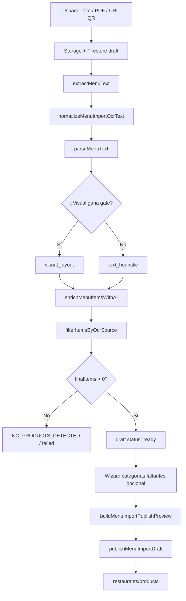

# Auditoría del pipeline de Importación IA — Hostly

**Fecha:** 2026-06-05  
**Alcance:** Solo código (`lib/server/menu-imports/**`, APIs `app/api/menu-imports/**`, UI `app/dashboard/configuracion/carta/importacion/**`).  
**Restricción:** Sin cambios implementados. Sin métricas de producción agregadas (no hay telemetría centralizada del pipeline en el repo).

**Evidencia:** HECHO CONFIRMADO = trazable en código. HIPÓTESIS = inferencia sin datos de campo.

---

## 1. Mapa del pipeline (end-to-end)

| Fase | Archivo principal | Salida |
|------|-------------------|--------|
| Extracción | `extract-menu-text.ts`, `vision-ocr.ts`, `fetch-remote-menu-url.ts` | `rawText`, opcional `ocrLayoutLines` |
| Parser | `parse-menu-text.ts`, `visual-menu-layout-parser.ts` | `ImportedMenuItem[]` |
| IA | `enrich-menu-items-with-ai.ts` | categoría/estación/confianza/duplicados internos |
| Validación OCR | `validate-items-against-ocr.ts` | filtra items no sustentados por texto OCR |
| Categorías | `create-menu-import-categories.ts` | escribe `restaurantes/.../cartaCategorias` |
| Publicación | `evaluate-import-item-for-publish.ts`, `publish-menu-import-draft.ts` | escribe `restaurants/.../products` |

---

## 2. Análisis por componente

### 2.1 OCR

**HECHO CONFIRMADO**

| Origen | Método | Layout (coordenadas) |
|--------|--------|----------------------|
| Imagen (`image`) | Google Vision `documentTextDetection` | **Sí** → `ocrLayoutLines`, `ocrPageWidth/Height` |
| PDF con texto embebido ≥ 40 chars | `pdf-parse` (`extractPdfEmbeddedText`) | **No** |
| PDF escaneado / sin texto | Vision `batchAnnotateFiles` (máx. 5 páginas) | **No** |
| QR → PDF remoto | Igual que PDF subido | **No** |
| QR → HTML | `fetch` + `htmlToVisibleText` (sin JS) | **No** |

Límites relevantes (`menu-import-limits.ts`):

- Imagen/PDF subido: 12 MB
- URL remota: 5 MB, timeout 15 s
- OCR timeout: 45 s
- PDF OCR: máx. 5 páginas (`MAX_VISION_PDF_PAGES`)
- Texto OCR mínimo para validación posterior: 40 chars (`MIN_OCR_SOURCE_TEXT_LENGTH`)

Normalización previa al parser (`normalizeMenuImportOcrText`): unifica saltos de línea, corrige `|`→`I`, colapsa líneas vacías.

**Puntos de fallo**

- Vision no configurado → error duro (`getVisionClient() === null`).
- Imagen sin texto → error duro.
- PDF escaneado sin texto tras OCR → error duro.
- QR con HTML dinámico (SPA) → texto insuficiente → error (`MIN_PDF_TEXT_CHARS`).

**HIPÓTESIS:** Cartas con tipografía decorativa, bajo contraste o fotos borrosas degradan todo el pipeline aguas abajo (parser + validación OCR).

---

### 2.2 Parser textual (`text_heuristic`)

**HECHO CONFIRMADO** — `parse-menu-text.ts`

Estrategia por línea (orden de precedencia):

1. Ruido legal/IVA → descartada (`NOISE_LINE_RE`)
2. Cabecera de sección → actualiza contexto (`looksLikeSectionHeader`, `SECTION_HINTS` ~14 patrones)
3. Nombre+precio en la misma línea → producto (`PRICE_TRAILING_RE`, `PRICE_LEADING_RE`, etc.)
4. Bloque multilingüe (solo secciones pasta/risotto) → producto con `forceNeedsReview`
5. Bloque columna: ≥2 precios “fuertes” + `pendingNames` → emparejamiento
6. Precio huérfano + nombre pendiente → emparejamiento
7. Línea de traducción en sección multilingüe → descartada
8. Candidato a nombre → entra en cola `pendingNames` (sin precio aún)

Confianza y selección:

- `needsReview` si: sin precio, confianza < 75, nombre < 4 chars, o `forceNeedsReview`
- `selectedForPublish` solo si `!needsReview` (parser textual)

**Pérdidas estructurales del parser textual**

- Nombres en `pendingNames` sin precio posterior → warning *"nombre(s) sin precio emparejado al final del OCR"* → **producto perdido**.
- Precios ambiguos (enteros sin decimales en contexto dudoso) → `ambiguous_price_skipped` → **precio/producto perdido**.
- Traducciones fuera de sección pasta/risotto → `translation_line_skipped` → **línea ignorada** (puede ser nombre real mal clasificado).
- Secciones no reconocidas por `SECTION_HINTS` → categoría genérica "General" → impacto en publicación, no en detección.

---

### 2.3 Parser visual (`visual_layout`)

**HECHO CONFIRMADO** — `visual-menu-layout-parser.ts`, `visual-menu-commercial-name.ts`

**Precondiciones (gate):**

| Razón de gate | Condición |
|---------------|-----------|
| `no_ocr_layout_lines` | Sin coordenadas (PDF, QR HTML, PDF embebido) |
| `layout_lines_lt_4` | Menos de 4 líneas con layout |
| `page_width_invalid` | Ancho de página inválido |
| `visual_blocks_lt_2` | Menos de 2 bloques producto detectados |

**Selección visual vs textual** (`shouldSelectVisualParser`):

- Visual gana si `visualItemsCount >= 5`, **o**
- `visualItemsCount >= textItemsCount * 0.7` (con texto > 0)

Heurísticas internas:

- Split de columnas por mediana de `centerX` (`computeColumnSplitX`)
- Precios a la derecha del split; nombres a la izquierda
- Banda vertical (`medianLineHeight * 3.8`) para agrupar bloque
- Normalización de nombre comercial con preferencia ES/IT sobre EN/DE/FR
- Recuperación de bloques con precios sin pareja (`recoverVisualBlocksFromUnpairedPrices`)

Items del parser visual:

- `forceNeedsReview: true` por defecto
- `selectedForPublish` vía `shouldAutoSelectVisualImportItem` (requiere hint de categoría + sin bloqueo crítico)

**Limitación crítica:** El parser visual **solo se ejecuta en imágenes** con layout Vision. PDFs y QR nunca entran en este camino.

---

### 2.4 PDFs

**HECHO CONFIRMADO**

1. **PDF nativo (texto seleccionable):** extracción directa, sin OCR, sin layout → parser **solo textual**.
2. **PDF escaneado:** OCR Vision multi-página (≤5), texto concatenado, sin layout.
3. Warning fijo: *"OCR PDF limitado a las primeras 5 páginas"* aunque el PDF tenga menos páginas.

**Riesgos específicos PDF**

- Pérdida de productos en páginas > 5 (**HECHO CONFIRMADO** por límite).
- Orden de lectura del texto embebido puede no reflejar columnas → empeora emparejamiento nombre/precio (**HIPÓTESIS** frecuente en cartas de dos columnas).
- Sin `ocrLayoutLines` → gate visual siempre `no_ocr_layout_lines`.

---

### 2.5 QR (`qr_url`)

**HECHO CONFIRMADO** — `fetch-remote-menu-url.ts`, `extractFromQrUrl`

Flujo:

1. `GET` con redirects, validación anti-SSRF (bloquea hosts privados)
2. Si contenido es PDF → pipeline PDF
3. Si HTML → strip tags estático (`htmlToVisibleText`), sin ejecutar JavaScript
4. Si texto visible < 40 chars → error

**No soportado explícitamente**

- Menús renderizados en cliente (React/Vue/Angular)
- Menús que requieren interacción (tabs, acordeones)
- Imágenes de carta servidas como fondo sin texto alternativo
- Autenticación en URL

---

### 2.6 Cartas multilingües

**HECHO CONFIRMADO**

Soporte **acotado** al patrón:

- Sección debe coincidir con `MULTILINGUAL_SECTION_RE` → `\b(pasta|pastas|risott[oi]|risotto)\b`
- Bloque: 1 línea primaria + hasta 2 traducciones + 1 línea precio
- Detección de traducción: regex EN/DE/FR (`TRANSLATION_*_RE`) + heurística primer token igual

Parser visual: normalización multilingüe más amplia (`visual-menu-commercial-name.ts`) pero solo cuando el gate visual se activa.

**Fuera de pasta/risotto:** las líneas en inglés/alemán/francés se tratan como `translation_line_skipped` u `ignored` → **alta probabilidad de pérdida** en cartas trilingües de pizzas, entrantes, postres, vinos, etc.

---

### 2.7 Publicación

**HECHO CONFIRMADO** — `evaluate-import-item-for-publish.ts`, `publish-menu-import-draft.ts`, `build-publish-preview.ts`

Umbrales:

| Constante | Valor | Efecto |
|-----------|-------|--------|
| `LOW_CONFIDENCE_THRESHOLD` | 75 | Warning + acción `review` |
| `BLOCK_CONFIDENCE_THRESHOLD` | 55 | Bloqueo preview duro |
| `PUBLISH_MIN_CONFIDENCE` | 40 | Bloqueo publicación |
| `DUPLICATE_ACTION_THRESHOLD` | 0.88 | Requiere confirmación duplicado catálogo |

Bloqueos de publicación (`publishBlockReasons`):

- Nombre vacío
- Precio inválido/ausente
- **Categoría inexistente** (`resolveImportCategory` no encuentra match)
- Confianza < 40
- Duplicado interno del borrador
- Duplicado catálogo sin confirmar

Selección para publicar:

- Solo items con `selectedForPublish === true` (salvo confirmación manual `confirmReviews`)
- Producto escrito en `restaurants/{id}/products` con `categoryId` de categoría resuelta
- Hereda `productFamilyId` de la **categoría**, no del producto importado

Post-procesamiento:

- `inferTipoVentaFromCartaText` para `tipoVenta`
- `mapStationToPreparationArea` para área de preparación
- Sin inventario/receta/modificadores en el documento creado

---

### 2.8 Categorías

**HECHO CONFIRMADO**

| Operación | Ruta Firestore |
|-----------|----------------|
| Lectura (publish/preview/IA) | Dual: `restaurantes/.../cartaCategorias` + `restaurants/.../cartaCategorias` |
| Escritura import IA | **Solo** `restaurantes/.../cartaCategorias` (`create-menu-import-categories.ts`) |
| Productos publicados | `restaurants/.../products` con `categoryId` |

Resolución en publish (`resolveImportCategory`):

1. `findCartaCategoriaByNameLoose`
2. `categoryNamesEquivalent`
3. Match parcial `includes` bidireccional

`hasImportCategoryHint` acepta `suggestedCategory` **o** `sectionName`, pero `resolveImportCategory` **solo usa `suggestedCategory`** → si la IA cambia la categoría sugerida a un nombre que no existe en Hostly, el item queda bloqueado aunque `sectionName` sí coincida (**HECHO CONFIRMADO** — gap de resolución).

Wizard UI (`MissingCategoriesWizard`) mitiga parcialmente creando categorías antes de publicar.

---

### 2.9 Familias

**HECHO CONFIRMADO**

- `productFamilies` canónico en `restaurants/.../productFamilies` (Comida/Bebidas/Otros)
- Al **crear categoría** desde import: `resolveProductFamilyForCategoryType` + `buildCategoryProductFamilyFields`
- Al **publicar producto**: copia `productFamilyId/Name/Type` desde la categoría resuelta
- **No hay** inferencia de familia por nombre de producto en el pipeline de importación
- Loader dual lee `restaurants` + `restaurantes/productFamilies` (no `familiasProducto` legacy de modificadores)

**Conclusión:** Las familias de producto en import son un subproducto del tipo de categoría, no del análisis del ítem.

---

### 2.10 Modificadores

**HECHO CONFIRMADO — NO IMPLEMENTADO en importación**

- El pipeline **no extrae, no infiere ni publica** grupos de modificadores
- `load-hostly-carta-categories.ts` **lee** `modifierGroupIds` si ya existen en la categoría
- `publish-menu-import-draft.ts` **no** escribe `modifierGroupIds` en productos nuevos
- Dominio canónico TPV: `restaurants/modifierGroups` — sin integración con menu-import
- `familiasProducto` / `gruposModificadores` (legacy) no participan en import

**Impacto:** Productos importados llegan al TPV sin modificadores; el operador debe configurarlos manualmente después.

---

## 3. Respuestas A–E

### A. Principales puntos de pérdida de productos (hoy)

Ordenados por severidad estructural:

| # | Punto de pérdida | Fase | Tipo |
|---|------------------|------|------|
| 1 | **Emparejamiento nombre↔precio fallido** (cola `pendingNames`, layouts multi-columna sin ≥2 precios fuertes) | Parser textual | Pérdida total del ítem |
| 2 | **Gate visual inactivo** en PDF/QR/HTML (sin `ocrLayoutLines`) | Parser | Pérdida de precisión; en layouts complejos ≈ pérdida masiva |
| 3 | **Validación OCR post-IA** (`filterItemsByOcrSource`) rechaza nombres no encontrados en texto bruto | Post-IA | Pérdida total del ítem |
| 4 | **Cartas multilingües fuera de pasta/risotto** (traducciones descartadas) | Parser textual | Pérdida parcial/total según layout |
| 5 | **Precios ambiguos omitidos** (`ambiguous_price_skipped`) | Parser textual | Ítem sin precio → `needsReview` o descarte en publicación |
| 6 | **PDF > 5 páginas** | OCR | Pérdida de ítems en páginas no procesadas |
| 7 | **QR / HTML sin texto estático** | Extracción | Fallo completo del borrador |
| 8 | **Umbral `NO_PRODUCTS_DETECTED`** si todos los ítems caen en validación OCR | Pipeline | Fallo completo del borrador |
| 9 | **IA limitada a 80 ítems** (`MAX_ITEMS_FOR_AI`) | Enriquecimiento | No pierde ítems, pero los excedentes no reciben ajuste de categoría/confianza |
| 10 | **Publicación bloqueada** (categoría inexistente, confianza, duplicado) | Publish | Ítem detectado pero no llega a catálogo TPV |

---

### B. Tipos de carta que peor funcionan

| Tipo de carta | Por qué falla | Evidencia |
|---------------|---------------|-----------|
| **Menú QR SPA/JS** | Sin texto en HTML estático | `htmlToVisibleText`, `MIN_PDF_TEXT_CHARS` |
| **PDF escaneado multi-columna** | Sin layout; orden OCR lineal | Sin `ocrLayoutLines` en PDF OCR |
| **PDF largo (>5 páginas)** | Truncado silencioso | `MAX_VISION_PDF_PAGES` |
| **Trilingüe (pizza, carnes, pescados, vinos)** | Regex multilingüe solo pasta/risotto | `MULTILINGUAL_SECTION_RE` |
| **Carta con precios en tabla/grid irregular** | Parser espera precio a derecha o en línea | Visual + textual column heuristics |
| **Lista de vinos (copa/botella, añadas)** | Nombres similares, duplicados, precios múltiples | `findImportProductDuplicates` conservador |
| **Carta “mixta” con secciones no estándar** | `SECTION_HINTS` limitado; categoría "General" | `SECTION_HINTS` hardcoded |
| **Foto con ángulo/sombra/bajo contraste** | OCR ruidoso → parser + validación fallan | Cadena OCR → validación |
| **Menú con precios enteros sin decimales** | `ambiguous_price_skipped` | Parser precio |

---

### C. Porcentaje aproximado de dependencia de heurísticas

Estimación por **peso de decisiones** en el código (no por tiempo de CPU):

| Etapa | % heurístico | Notas |
|-------|--------------|-------|
| Extracción OCR | **~25%** | Decisión PDF embebido vs OCR; strip HTML; normalización |
| Vision API (imagen/PDF OCR) | **0%** reglas propias | Servicio externo, pero resultado alimenta heurísticas |
| Parser textual | **~95%** | Regex, colas, gates, secciones hardcoded |
| Parser visual | **~90%** | Geometría + umbrales + scoring idioma |
| Enriquecimiento IA | **~40%** | LLM estructurado, pero merge/validación es regla fija |
| Validación OCR | **100%** | Tokens, compact match, umbrales 60% |
| Evaluación publish | **~95%** | Umbrales confianza, fuzzy categoría, Dice duplicados |
| Categorías/familias | **~85%** | Inferencia tipo por nombre; familia por tipo categoría |
| Modificadores | **N/A** | No hay etapa |

**Estimación global del pipeline (detección → publicación): ~75–85% depende de heurísticas.**

Desglose conceptual:

- **Detección de productos (¿qué entra al borrador?):** ~90% heurístico (parser + validación OCR). La IA no crea productos nuevos por diseño.
- **Calidad y publicabilidad:** ~70% heurístico (umbrales, categorías, duplicados) + ~30% IA (confianza/categoría sugerida).

---

### D. Partes que generan más errores reales

Clasificación **error real** = dato incorrecto en catálogo o ítem usable perdido/bloqueado incorrectamente.

| Área | Error típico | Frecuencia relativa |
|------|--------------|---------------------|
| **Emparejamiento precio↔nombre** | Precio de otro plato, plato sin precio | **Alta** |
| **Categoría no resuelta en publish** | `Categoría inexistente` pese a sección OCR correcta | **Alta** |
| **Validación OCR post-IA** | Rechazo de nombre válido (OCR fragmentado, nombre corto) | **Media-alta** |
| **Duplicados catálogo** | Falso positivo bloquea publicación (vinos, cócteles) | **Media** |
| **Sección mal inferida** | Producto en categoría incorrecta (SECTION_HINTS / IA) | **Media** |
| **Selección visual vs textual** | Visual gana con conteo marginal pero pierde ítems | **Media** (solo imágenes) |
| **QR/HTML** | Borrador fallido o carta casi vacía | **Alta** en ese subtipo |
| **Multilingüe** | Nombre en idioma equivocado o ítem omitido | **Media** en italiano turístico |
| **Confianza / needsReview** | Ítems válidos no auto-seleccionados | **Media** |
| **Modificadores ausentes** | No es error de parsing, pero operación incompleta | **Alta** impacto operativo |

**Errores que NO son del pipeline sino del modelo de datos:**

- Categorías creadas en `restaurantes` mientras otros flujos esperan `restaurants` (**HECHO CONFIRMADO** en auditorías previas de `cartaCategorias`).
- Familias de modificadores (`familiasProducto`) vs familias de producto (`productFamilies`) — dominios distintos, sin puente en import.

---

### E. Cinco cambios con más impacto y menor riesgo

Propuestas **solo de diseño** (no implementadas). Criterio: alto impacto en ítems recuperados o publicados, bajo riesgo de regresión o efectos colaterales en TPV.

| # | Cambio | Impacto esperado | Riesgo | Archivos afectados (futuro) |
|---|--------|------------------|--------|----------------------------|
| **1** | **Ampliar `MULTILINGUAL_SECTION_RE` y detección de bloques** a pizzas, pescados, carnes, entrantes (reutilizar lógica visual de `visual-menu-commercial-name`) | Recupera ítems en cartas trilingües turísticas (caso frecuente en ES) | Bajo — scope acotado al parser; no toca publish ni Firestore | `parse-menu-text.ts` |
| **2** | **Fallback de categoría: resolver también con `sectionName`** cuando `suggestedCategory` no matchea (`resolveImportCategory(item.suggestedCategory \|\| item.sectionName)`) | Reduce bloqueos "Categoría inexistente" sin crear categorías erróneas | Bajo — solo relaja matching hacia nombres ya existentes | `evaluate-import-item-for-publish.ts` |
| **3** | **Validación OCR condicional:** si el parser emparejó precio con `name_price_inline` o `column_block_matched`, relajar rechazo para nombres cortos (1 token ≥3 chars en OCR) | Menos falsos rechazos post-IA manteniendo anti-alucinación | Bajo-medio — requiere tests con borradores reales | `validate-items-against-ocr.ts` |
| **4** | **Warnings explícitos al usuario** para PDF >5 páginas, QR con texto < umbral, y conteo `pendingNames` / `likelyUnparsedOcrLines` en UI (ya existen en debug report) | No mejora parsing, pero elimina "importación silenciosamente incompleta" | Muy bajo — solo UX/visibilidad | `import-menu-page-content.tsx`, `process-menu-import-draft.ts` |
| **5** | **Gate visual: no degradar si `textItemsCount` supera a `visualItemsCount` por margen amplio** (p. ej. texto ≥ visual × 1.3 y visual < 5) — evitar que visual “gane” con 70% de recall | Reduce sustitución por parser inferior en fotos ambiguas | Bajo-medio — ajuste de umbral en una función | `parse-menu-text.ts` (`shouldSelectVisualParser`) |

**Cambios deliberadamente excluidos por mayor riesgo** (mención breve):

- Migrar escritura de categorías a `restaurants` (riesgo multi-tenant / reglas Firestore).
- Crear modificadores automáticamente desde import (dominio complejo, legacy split).
- Permitir que la IA invente productos no parseados (viola reglas actuales anti-alucinación).

---

## 4. Instrumentación existente (diagnóstico)

| Herramienta | Uso |
|-------------|-----|
| `scripts/diagnose-menu-import-target.ts` | Replay OCR → parser → IA → validación por fragmento de nombre de archivo |
| `scripts/diagnose-visual-parser-gate.ts` | Comparación `visual_layout` vs `text_heuristic` |
| `HOSTLY_MENU_IMPORT_DEBUG=1` | Debug report en proceso (`menu-import-debug-report.ts`) |
| `ImportMenuDebugPanel` | UI dev para trazabilidad |

**HIPÓTESIS:** Ejecutar estos scripts contra un corpus de 15–20 cartas reales permitiría cuantificar A–D con datos; el repo no contiene ese corpus ni agregados.

---

## 5. Resumen ejecutivo

| Dimensión | Estado actual |
|-----------|---------------|
| Fortaleza | Pipeline determinista, anti-alucinación IA, parser visual sofisticado para fotos con layout |
| Debilidad principal | Dependencia de heurísticas de emparejamiento nombre/precio sin layout (PDF/QR) |
| Hueco de dominio | Modificadores no importados; familias solo vía categoría |
| Hueco de datos | Escritura categorías en `restaurantes`, productos en `restaurants` |
| Fallo catastrófico | QR SPA, PDF largo escaneado, carta multilingüe no-pasta |

---

## 6. Referencias de código clave

| Tema | Archivo |
|------|---------|
| Orquestación | `lib/server/menu-imports/process-menu-import-draft.ts` |
| OCR / PDF / imagen | `lib/server/menu-imports/extract-menu-text.ts`, `vision-ocr.ts` |
| QR remoto | `lib/server/menu-imports/fetch-remote-menu-url.ts` |
| Parser textual + gate visual | `lib/server/menu-imports/parse-menu-text.ts` |
| Parser visual | `lib/server/menu-imports/visual-menu-layout-parser.ts` |
| IA enriquecimiento | `lib/server/menu-imports/enrich-menu-items-with-ai.ts` |
| Validación OCR | `lib/server/menu-imports/validate-items-against-ocr.ts` |
| Publish | `lib/server/menu-imports/publish-menu-import-draft.ts`, `evaluate-import-item-for-publish.ts` |
| Categorías import | `lib/server/menu-imports/create-menu-import-categories.ts` |
| Límites | `lib/server/menu-imports/menu-import-limits.ts` |

---

*Documento generado en auditoría read-only. No se ha modificado código de producción.*
